```mermaid
graph TD
	subgraph addDiscountCode [Add Discount Code]
		lockUsers2[Lock Users] 
		--> updateUser4([Check if user has discount])
		--> lockDiscounts2[Lock Discounts] 
		--> checkDiscount1([Check if discount code is valid]) 
		--> decreaseDiscount2([Decrease discount code uses]) 
		--> updateUser2([Update user discounts]) 
		--> unlockUsers2[Unlock Users] 
		--> unlockDiscounts2[Unlock Discounts]
	end

	subgraph orderFlow [Order flow]
		lockDiscounts[Lock Discounts] 
		--> checkDiscount2([Check if discount code is valid]) 
		--> lockOrders[Lock Orders] 
		--> addOrder([Add order]) 
		--> lockUsers[Lock Users] 
		--> updateUser([Update user points]) 
		--> updateUser3([Update user discounts]) 
		--> decreaseDiscount([Decrease discount code uses]) 
		--> unlockDiscounts[Unlock Discounts] 
		--> unlockOrders[Unlock Orders] 
		--> unlockUsers[Unlock Users]
	end
```

# MfpcApi

## Transactions

- Place order flow:
  - Add order
  - Decrease discount code uses
  - Update user points

- User add discount code:
  - Update user discount codes
  - Decrease discount code uses

